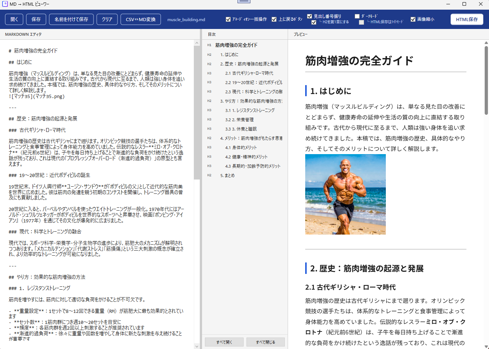

# SideTOCer

[](https://opensource.org/licenses/MIT)
[](https://dotnet.microsoft.com/download/dotnet/8.0)

**SideTOCer** は、Markdown を HTML に変換しながら、自動でTOC（目次）作成や見出し番号振りなど便利機能を付与できるデスクトップアプリです。
Markdown 編集機能も一通り備えています。



## 🚀 主な機能

### HTML変換

* **TOC 付与**: 自動で見出しから目次を作成して、サイドバー目次付きHTML として出力します。
* **自動採番**: 見出し番号を振ります。H1 起点 / H2 起点を切り替え可能です。
* **アコーディオン一括操作**: `details` 要素をまとめて開く / 閉じるボタンを設置します。
* **ダークモード**: アプリ全体やHTMLをダークモードで表示できます。
* **画像縮小**: 埋め込まれた画像を縮小できます。
* **画像ライトボックス**: 画像をクリックすると拡大表示できます。リンク付き画像は通常のリンク動作を優先します。
* **Mermaid 記法対応**: ` ```mermaid ` で記述されたダイアグラム（フローチャートやシーケンス図など）を自動でレンダリングして HTML に埋め込み・プレビュー表示できます。

### MD編集機能

* **Markdown 編集**: 変換前の Markdown をそのまま編集できます。
* **ドラッグ＆ドロップ対応**: Markdownファイルを直接ドロップでもファイルを開けます。
* **検索・置換**: `Ctrl + F` で検索、`Ctrl + H` で置換ができます。
*  **ハイライト**: プレビュー側の文をドラッグ選択することでエディター側がハイライトされます。
* **画像埋め込み**: ローカル画像を Markdown にドロップして、相対パスとして挿入できます。
* **CSV ↔ Markdown テーブル変換**: CSV と Markdown テーブルを相互変換するツールを内蔵しています。

## 📋 動作要件

* **OS**: Windows 10 / 11 (64bit)
* **ランタイム**: [.NET 8.0 Desktop Runtime](https://dotnet.microsoft.com/download/dotnet/8.0)
* **追加要件**: Microsoft Edge WebView2 Runtime

## 🛠 使い方

1. `SideTOCer.exe` を実行します。
2. Markdown を左側のエディタに入力するか、`開く` で既存ファイルを読み込みます。
3. 右側のプレビューで内容を確認します。
4. 必要に応じて、見出し番号振り、ダークモード、アコーディオン一括操作、上に戻るボタン、画像縮小を切り替えます。
5. `HTML保存` で、目次付きのHTMLを出力します。
## 📦 インストール / 開発

### インストール方法

1. 以下のリンクから最新の `SideTOCer.zip` をダウンロードします。

   [SideTOCer.zip をダウンロード](https://github.com/OtabiHirohito/SideTOCer/releases)

2. ダウンロードしたZIPファイルを任意の場所に展開します。
3. 展開したフォルダー内の `SideTOCer.exe` を実行します。

4. 初回起動時に WebView2 Runtime の導入が求められる場合があります。

### ビルド方法

1. [Visual Studio 2022](https://visualstudio.microsoft.com/ja/vs/) または [.NET 8 SDK](https://dotnet.microsoft.com/download/dotnet/8.0) をインストールします。
2. リポジトリをクローンします。

   ```bash
   git clone https://github.com/OtabiHirohito/SideTOCer.git
   ```

3. ソリューションファイル `SideTOCer.sln` を開いてビルドするか、コマンドラインで以下を実行します。

   ```bash
   dotnet build
   ```

## 🤝 寄付について

   このソフトを気に入っていただけた場合は、よろしければ以下の寄付先への支援をご検討ください。
<sub>本ソフトおよび制作者はリンク先の組織とは一切関係がございません。</sub>

* [寄付先1](https://www.savechildren.or.jp/contribute/ "セーブ・ザ・チルドレン")
* [寄付先2](https://arkbark.net/support/donate/ "Animal Refuge Kansai")

## 📄 ライセンス

このプロジェクトは **MITライセンス** のもとで公開されています。詳細は [LICENSE.txt](LICENSE.txt) をご覧ください。

---

Created by 大度寛仁 / X (Twitter): [@OtabiHirohito](https://x.com/OtabiHirohito)
